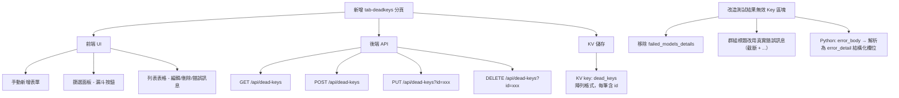

# 功能規劃：失效密鑰管理分頁 + 測試結果無效 Key 改造（v3）

**實作前的草案，已被 `docs/decision-*.md`（持續維護的決策說明）取代，不要照本文的細節實作。**
實作過程中被推翻的部分至少有兩處：

- §3.3 要求 record 新增 `error_body`（512 字元）供事後解析——實際改為在 record 產生當下、
  `err` 還完整時就解析成結構化的 `error_detail`，**不存 `error_body`**（原因見 decision §1.2）。
- §0／§3.1 的分組鍵是逐字比對 `error_reason`——實際改為正規化後比對（見 decision §1.3）。

文中的 `parse_error_body`／`pick_error_message` 程式碼區塊都是草稿版本，與最終實作不同。保留本文只為記錄需求與 UI 規劃的來由。

## 一、整體架構概覽



### 0. 共用規則：顯示真實錯誤訊息

原本的說明文字（如 `Key 专属硬伤 (Hard Failure - 401)`）只是人工歸類，**不告訴使用者供應商到底回了什麼**。改為一律顯示供應商回傳的真實訊息：

- **訊息來源**：`error_detail.message` → `error_detail.msg` → `error_detail.raw`，皆無時才 fallback 回原本的說明文字
- **去重**：同一組（同一訊息文字）只保留第一筆的 `error_detail`，其餘存 `null`；顯示時從該組第一筆非 null 的記錄取值
- **截斷**：顯示層統一用 `truncate(text, 120)` — 超過 120 字元取前 120 字元並加上 `...` 後綴；完整內容放在 `title` 屬性與錯誤詳情 modal 中

```js
function truncate(s, n = 120) {
  s = String(s ?? "").replace(/\s+/g, " ").trim();
  return s.length > n ? s.slice(0, n) + "..." : s;
}
```

---

## 二、新增「失效密鑰」分頁（新 tab）

### 2.1 KV 資料結構

新增一個 KV key `dead_keys`，存儲陣列：

```json
{
  "dead_keys": [
    {
      "id": "uuid-v4",
      "provider_host": "api.openai.com",
      "api_key": "sk-xxxx...xxxx",
      "expired_at": "2026-06-10T00:00:00.000Z",
      "error_code": 401,
      "error_detail": {
        "message": "Incorrect API key provided: sk-xxxx...xxxx",
        "type": "invalid_request_error",
        "code": "invalid_api_key"
      },
      "created_at": "2026-06-10T12:34:56.000Z"
    }
  ]
}
```

- `error_detail`：**結構化的 key-value 物件**，由 Python 解析原始 error body 而來
  - 嘗試 `json.loads(body)` 後提取常見欄位：`message`/`msg`、`type`、`code`、`param`、`status`
  - 若解析失敗（非 JSON），fallback 為 `{"raw": "原始文字（截斷 512 字元）"}`
- `error_detail` 去重邏輯：**同一 `provider_host` + 同一 `error_code`** 只保留第一筆的 `error_detail`，後續記錄存 `null`
- `id`：用 `crypto.randomUUID()` 生成

### 2.2 雙重去重邏輯（POST 時）

#### Key 去重
1. 讀取現有 `dead_keys` 陣列
2. 比對 `api_key` 是否已存在（全域比對，不限 provider_host）
3. 若已存在 → **不新增**，以最早新增的（`created_at` 最小）為準，回傳 `409 Conflict`

#### error_detail 去重
1. `api_key` 不重複，允許新增
2. 檢查陣列中是否已有同 `provider_host` + 同 `error_code` 且 `error_detail` 非 null 的記錄
3. 若有 → 新記錄的 `error_detail` 設為 `null`
4. 若無 → 保留新記錄的 `error_detail`

### 2.3 後端 API（`_worker.js`）

| Route | 功能 |
|---|---|
| `GET /api/dead-keys` | 讀取全部 dead_keys，需 auth |
| `POST /api/dead-keys` | 新增一筆，自動 key 去重 + error_detail 去重 |
| `PUT /api/dead-keys?id=xxx` | 編輯指定記錄 |
| `DELETE /api/dead-keys?id=xxx` | 刪除指定記錄 |

### 2.4 前端 UI

**HTML**（`index.html`）：
- 在 nav `.tabs` 新增第三個 tab 按鈕：`失效密鑰`（`data-tab="deadkeys"`）
- 新增 `<section id="tab-deadkeys" class="tab-panel hidden">`

**佈局結構**：

```
┌────────────────────────────────────────────────────────────────┐
│  [域名供應商 ▼] [Key 輸入框] [失效時間 📅] [新增]               │
│  [🔽 篩選]  ← 漏斗 icon，點擊展開篩選面板                        │
├────────────────────────────────────────────────────────────────┤
│  篩選面板（預設收合，點漏斗圖示展開）：                            │
│  ├─ 供應商域名下拉（同步 state.settings.providers 的域名列表）    │
│  ├─ Key 名稱搜尋框（即時模糊匹配）                               │
│  └─ 時間範圍（兩個 <input type="date">）                        │
│     選同一天 = 篩選該天；選不同天 = 篩選區間                      │
├────────────────────────────────────────────────────────────────┤
│  表格                                                          │
│  ┌──────────┬──────────┬──────────┬──────────────────────┐     │
│  │ 域名供應商 │   KEY    │ 失效時間  │       操作           │     │
│  ├──────────┼──────────┼──────────┼──────────────────────┤     │
│  │ api.xx   │ sk-abc.. │ 2026-06  │ [📋][✏️][🗑️]         │     │
│  │ api.yy   │ sk-def.. │ 2026-05  │ [📋][✏️][🗑️]         │     │
│  └──────────┴──────────┴──────────┴──────────────────────┘     │
└────────────────────────────────────────────────────────────────┘
```

**操作按鈕說明**：
- 📋 **錯誤訊息**：點開 modal 顯示 `error_code` + `error_detail`（以 key-value 表格呈現，**modal 內顯示完整內容、不截斷**）
  - 若該筆的 `error_detail` 為 null（被去重），**直接顯示同 `provider_host` + 同 `error_code` 的第一筆 error_detail 內容**
  - 使用者不需要自己去找第一筆在哪，點開就直接看到
  - 按鈕旁以灰字附上 `truncate(message, 120)` 的預覽，不必點開也看得到大概死因
- ✏️ **編輯**：打開 modal 編輯域名、Key、失效時間、error_code
- 🗑️ **刪除**：確認後刪除該筆記錄

**錯誤訊息 modal 顯示方式**：

比照 sample modal 的 key-value 風格，例如：

```
┌─ 錯誤詳情 ───────────────────────────────────┐
│  Error Code: 401                              │
│                                               │
│  message    Incorrect API key provided:       │
│             sk-xxxx...xxxx                    │
│  type       invalid_request_error             │
│  code       invalid_api_key                   │
└───────────────────────────────────────────────┘
```

**篩選面板互動**：
- 漏斗按鈕 toggle 展開/收合篩選面板
- 域名下拉：**同步 `state.settings.providers`** — 新增/刪除供應商時，此下拉列表也會跟著更新（與測試結果頁的邏輯一致）
- Key 搜尋：即時模糊匹配（`includes`）
- 時間：兩個 `<input type="date">`
  - 兩個都選同一天 → 只篩選該天的記錄
  - 選不同天 → 篩選區間內（含首尾）的記錄
  - 都不選 → 不篩選時間

**新增表單的域名供應商下拉**：
- 同步自 `state.settings.providers`
- 從每個 provider 的 `api_base` 提取 `host`（使用現有的 `extractHost()` 函數）
- 若無任何 provider，顯示提示文字

---

## 三、改造測試結果的「無效 Key」區塊

### 3.1 群組標題改用真實錯誤訊息

群組標題列（`inv-group-header`）的結構不動（數量 badge、一鍵複製、展開/收合箭頭全部保留），**只改標題文字**：

- 原本：`Key 专属硬伤 (Hard Failure - 401)`
- 改為：`401 · Incorrect API key provided: sk-xxxx...xxxx`

**標題組成**：`{error_code} · {truncate(message, 120)}`，`error_code` 為 null 時省略前綴。完整訊息放 `title` 屬性（hover 可見）。

**分組鍵**：直接用 Python 產出的 `error_reason`（已是真實訊息），前端 `renderInvalidGroups` 的分組邏輯不變，同訊息自動歸為同一組 → 天然去重。

**`error_reason` 取值優先序（Python 端決定）**：

| 情境 | `error_reason` 值 |
|---|---|
| 供應商回傳可解析訊息 | `error_detail.message` / `msg` / `raw`（第一筆失敗記錄的） |
| 無任何可解析訊息 + 401/403 | `Key 专属硬伤 (Hard Failure - 401)` 或 `...(403)`（fallback） |
| 無訊息 + 部分模型被其他 Key 證實健康 | `全盘软失效 (测试的所有模型均失败，但部分模型被其他Key证实健康)` |
| 無訊息 + 全網皆敗 | `全部模型皆无响应 (无法断定是Key的问题，因全网皆败)` |

> `error_reason` 在 Python 端即截斷至 200 字元（避免 KV 膨脹），前端再截到 120 字元顯示；完整原文永遠可從該組第一筆的 `error_detail` 取得。

### 3.2 移除 `failed_models_details`（僅限 key 內部）

在 `app.js` 的 `renderInvalidGroups` 中：
- **移除** L979-983 的 `rec.failed_models_details` 渲染（`inv-models-details` div）
- 每個 key item 只顯示 `api_key` 本身
- 不再顯示 `{model}: {reason}` 的逐模型詳情
- 群組標題列新增 📋 按鈕：點開 modal 顯示該組**第一筆非 null 的 `error_detail`** 完整內容（與失效密鑰分頁共用同一個 error detail modal，不截斷）

### 3.3 Python 腳本改造（`async_test_keys.py`）

#### 新增 `parse_error_body` 函數

```python
def parse_error_body(body):
    """解析供應商回傳的錯誤 response body，提取結構化欄位。"""
    if not body:
        return {}
    try:
        data = json.loads(body)
    except (json.JSONDecodeError, ValueError):
        # 非 JSON（如 HTML 錯誤頁），fallback 存原始文字
        return {"raw": body[:512]}

    detail = {}
    # 嘗試提取常見欄位（覆蓋 OpenAI / Gemini / Anthropic / 代理商格式）
    error_obj = data.get("error", data)  # OpenAI 包在 error 裡，其他可能直接在頂層
    if isinstance(error_obj, dict):
        for key in ("message", "msg", "type", "code", "param", "status"):
            val = error_obj.get(key)
            if val is not None:
                detail[key] = str(val)
    # Anthropic 格式: {"type": "error", "error": {...}}
    if not detail and "error" in data and isinstance(data["error"], dict):
        for key in ("message", "type"):
            val = data["error"].get(key)
            if val is not None:
                detail[key] = str(val)

    return detail if detail else {"raw": body[:512]}
```

#### 修改 record 結構（L615-627）

- 將 `err[:100]` 改為保留更多內容，以便後續 `parse_error_body` 使用
- 具體做法：新增 `error_body` 欄位存完整 body（截斷 512 字元），`error` 欄位維持 100 字元（向下相容 checkpoint）

```python
record = {
    "model": model,
    "success": success,
    "status": status,
    "error": err[:100],           # 維持 100 字元（向下相容）
    "error_body": err[:512],      # 新增：512 字元版本（供 invalid_output 解析用）
    ...
}
```

#### 修改 `invalid_output` 生成（L725-768）

- **新增** `error_code`：該 key 所有失敗記錄中第一個非 200 的 HTTP status code
- **新增** `error_detail`：該 key 第一筆失敗記錄的 `error_body` 經 `parse_error_body()` 解析後的結構化物件
- **改寫** `error_reason`：優先用真實訊息（`message`/`msg`/`raw`），無訊息時才 fallback 回原本的說明文字
- **新增** `error_detail` 去重：同一 `error_reason` 只有第一筆保留 `error_detail`，其餘設為 `null`
- **移除** `failed_models_details`（L766-767）
- **移除** `key_errors` 收集（L732, L750）

```python
REASON_MAX_LEN = 200


def pick_error_message(detail):
    """從 parse_error_body 的結果取一句可讀訊息；取不到回 None。"""
    for key in ("message", "msg", "raw"):
        val = detail.get(key)
        if val and str(val).strip():
            text = " ".join(str(val).split())  # 壓平換行/多空白，避免標題破版
            return text[:REASON_MAX_LEN]
    return None


seen_detail_reasons = set()  # error_reason → 只有第一筆保留 error_detail

for k, records in results.items():
    key_all_failed = True
    hard_failure_reason = None
    first_error_status = None
    first_error_body = None

    for r in records:
        if r["success"]:
            key_all_failed = False
        else:
            status = r["status"]
            if first_error_status is None:
                first_error_status = status
                first_error_body = r.get("error_body", r.get("error", ""))
            if status in (401, 403):
                hard_failure_reason = f"Key 专属硬伤 (Hard Failure - {status})"

    if key_all_failed:
        detail = parse_error_body(first_error_body or "")
        message = pick_error_message(detail)

        if message:
            final_reason = message
        elif hard_failure_reason:
            final_reason = hard_failure_reason
        elif any(r["model"] in proven_working_models for r in records):
            final_reason = "全盘软失效 (测试的所有模型均失败，但部分模型被其他Key证实健康)"
        else:
            final_reason = "全部模型皆无响应 (无法断定是Key的问题，因全网皆败)"

        # 同一組訊息只存一份 detail，避免同樣的 body 重複塞進 KV
        if final_reason in seen_detail_reasons:
            detail = None
        elif detail:
            seen_detail_reasons.add(final_reason)

        invalid_output.append(
            {
                "api_key": k,
                "error_reason": final_reason,
                "error_code": first_error_status,
                "error_detail": detail,
            }
        )
    else:
        valid_keys.append(k)
```

#### 修改後的 `invalid_output` entry 結構

```json
[
  {
    "api_key": "sk-aaa",
    "error_reason": "Incorrect API key provided: sk-xxxx...xxxx",
    "error_code": 401,
    "error_detail": {
      "message": "Incorrect API key provided: sk-xxxx...xxxx",
      "type": "invalid_request_error",
      "code": "invalid_api_key"
    }
  },
  {
    "api_key": "sk-bbb",
    "error_reason": "Incorrect API key provided: sk-xxxx...xxxx",
    "error_code": 401,
    "error_detail": null
  }
]
```

前端渲染結果（兩把 key 併為同一組，標題即真實訊息）：

```
▼ 401 · Incorrect API key provided: sk-xxxx...xxxx   [2]  [一键复制] [📋]
    sk-aaa
    sk-bbb
```

#### 改造前後的顯示對照

`async_test_keys.py` L738-750 那套人工歸類的說明文字（含 per-model 的 `key_errors`）全部移除，改為顯示供應商原文：

| Status Code | 改造前顯示 | 改造後顯示（來自 `error_detail.message`，示意） |
|---|---|---|
| 401 | `Key 专属硬伤 (Hard Failure - 401)` | `401 · Incorrect API key provided: sk-xxxx...xxxx` |
| 403 | `Key 专属硬伤 (Hard Failure - 403)` | `403 · Your account is not active, please check...` |
| 402 | `Unknown Error` | `402 · 余额不足，请充值后重试` |
| 429 | `频控限流或响应超时 (Rate Limit / Timeout - 429)` | `429 · Rate limit reached for requests` |
| 400 / 404 | `模型不支持或不存在 (400)` | `404 · The model 'xxx' does not exist` |
| 其他 | `Unknown Error` | 供應商原文；非 JSON 時取 `raw` 前 512 字元 |

> 這正是改造的主要動機：402（余额不足）原本被歸進 `Unknown Error`，看不出真實死因；改用原文後直接顯示供應商說的話。若供應商連 body 都沒回（純連線失敗、空 body），`error_detail` 為 `{}`、`pick_error_message` 回 `None`，此時才 fallback 回原本的說明文字，行為與現況一致。

---

## 四、修改文件清單

| 文件 | 改動 |
|---|---|
| `public/index.html` | 新增第三個 tab 按鈕 + `tab-deadkeys` section + dead key 編輯 modal + dead key 錯誤訊息 modal |
| `public/app.js` | 新增 `truncate` 工具、`loadDeadKeys`、`renderDeadKeysTable`、篩選邏輯、CRUD 函數、error detail modal；修改 `renderInvalidGroups` 移除 `failed_models_details`、標題改真實訊息 + 📋 按鈕 |
| `public/style.css` | 新增 dead keys tab 的表格、篩選面板、表單、漏斗按鈕樣式 |
| `public/_worker.js` | 新增 `GET/POST/PUT/DELETE /api/dead-keys` 四個 route handler |
| `async_test_keys.py` | 新增 `parse_error_body` / `pick_error_message`；record 新增 `error_body`；`invalid_output` 移除 `failed_models_details`、`error_reason` 改真實訊息、新增 `error_code` + `error_detail`（同訊息只留第一筆） |

---

## 五、實作順序

1. **Phase 1** — Python 腳本改造 → `parse_error_body` + `pick_error_message` + `error_body` 欄位 + `error_code` / `error_detail` + `error_reason` 改真實訊息 + 移除 `failed_models_details`
2. **Phase 2** — 後端 API → 新增 `dead_keys` CRUD endpoints（含 key 去重 + provider_host+error_code 去重）
3. **Phase 3** — 前端測試結果改造 → `renderInvalidGroups` 移除 `failed_models_details`；群組標題改 `{error_code} · truncate(message, 120)` + 📋 錯誤詳情按鈕
4. **Phase 4** — 前端新分頁 → dead keys 表單 + 漏斗篩選 + 表格 + 編輯刪除 + 錯誤訊息 modal
